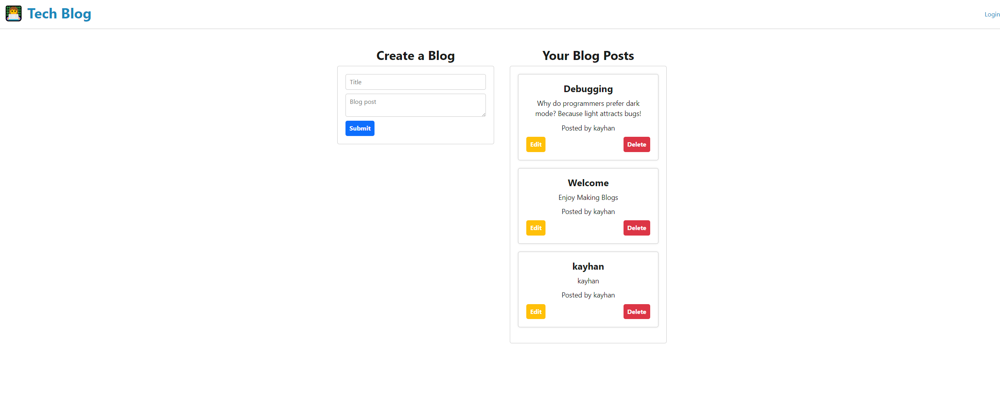

# 😁 Tech-Blog-MVC

## Description

The Model-View-Controller (MVC) Tech Blog is a CMS-style blog site for developers to publish their blog posts and comment on other developers' posts. The application follows the MVC paradigm and uses Handlebars.js as the templating language, Sequelize as the ORM, and the express-session npm package for authentication. The homepage displays existing blog posts, navigation links for the homepage and dashboard, and the option to log in. Users can sign up with a username and password to save their credentials and log in later. Once logged in, users can access the dashboard, where they can create new blog posts, edit existing posts, or delete posts. Users can also view existing blog posts on the homepage and leave comments on posts they choose. The application logs users out after a set idle time and prompts them to log in again to perform actions like adding, updating, or deleting comments. The application is deployed to Heroku.

## Technologies Used:

- HTML
- CSS
- javaScript
- Node.js
- Express.js
- MySQL
- Handlebars
- Sequalize
- dotenv

## Installation

1. Make sure you have Node.js and MySQL installed on your computer.
2. Clone the repository or download the source code.
3. Open the terminal or command prompt and navigate to the project directory.
4. Install the dependencies by running the command npm install.
5. Create a .env file in the root of the project directory, and add the following
   variables: DB_NAME=your_database_name
   DB_USER=your_mysql_username
   DB_PW=your_mysql_password
6. Create the database by running the command npm run db:create.
7. Seed the database with some sample data by running the command npm run db:seed.
8. Start the server by running the command npm start.
9. Open your web browser and go to http://localhost:3001 to see the application running.

## tests

No Tests were further done.

## Usage

1. Start the application by running npm start in the terminal.
2. Open a web browser and navigate to http://localhost:3001.
3. If you're a new user, click the "Sign Up" link in the navigation bar and fill in the registration form to create a new account. Otherwise, click the "Sign In" link and enter your email address and password to log in.
4. Once you're logged in, you'll be taken to the homepage, where you can view and read blog posts from other users.
5. To create a new blog post, click the "Dashboard" link in the navigation bar and then click the "New Post" button. Fill in the title and content fields and then click the "Create Post" button to save your new post.
6. To edit or delete an existing post, navigate to your dashboard and click the "Edit" or "Delete" button next to the post you want to modify.
7. To leave a comment on a post, click on the post title to view the full post and then fill in the comment form at the bottom of the page.
8. When you're finished using the application, click the "Logout" link in the navigation bar to sign out.

## Link

https://shrouded-taiga-72180.herokuapp.com

## Contact-Details

-linkedin: ://www.linkedin.com/in/kayhan-mamak-5423b4262/

- Github: https://github.com/byunn90

-Email: Kayhan_mamak@hotmail.com
